# Hi, I'm faiz 👋

Open-source contributor · Developer tooling · Rust / Python

  
  

## About me

- 🛠️ Building and improving developer tools
- 🦀 Interested in Rust, Python, LSP, and type checking
- 🌱 Making small, reviewable contributions to open-source projects
- 📍 Based in Asia/Shanghai

## Open-source contributions

- [Pyrefly](https://github.com/facebook/pyrefly) — Python type checking and LSP
- [Trivy](https://github.com/aquasecurity/trivy) — container and software security
- [AIRI](https://github.com/moeru-ai/airi) — open-source AI companion platform

## Tech stack

  
  
  
  

## Current focus

- Developer experience and language tooling
- Practical LSP and static-analysis improvements
- Contributing focused fixes with tests

<a href="https://github.com/lyydsheep?tab=repositories">Explore my repositories →</a>

